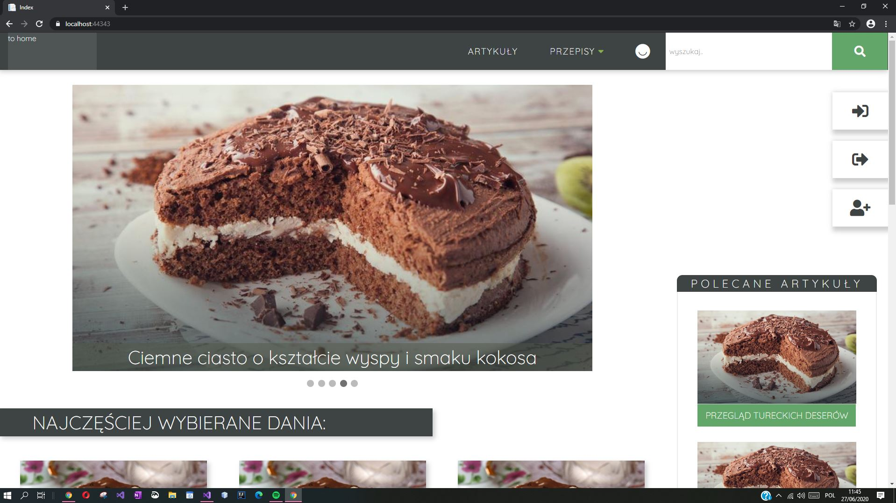
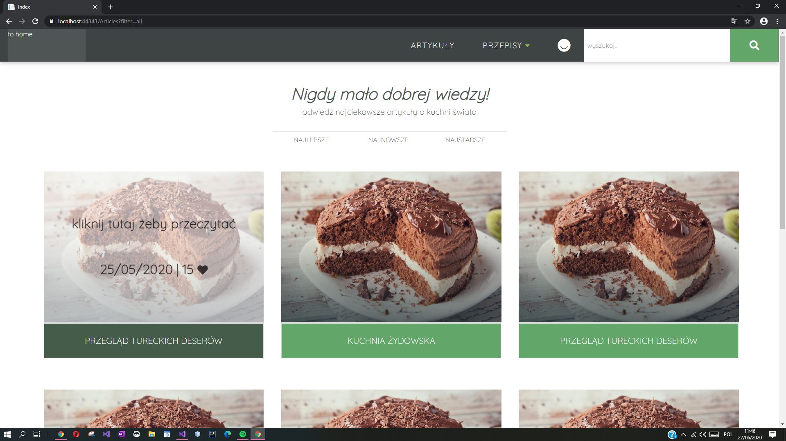
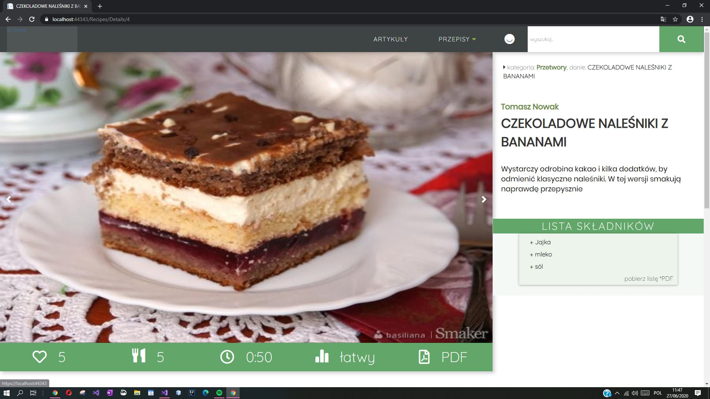

# Recipes webapp

> It's a responsive web app for kitchen lovers created in ASP.NET MVC using Entity Framework, HTML, CSS, Javascript, and jQuery.

### Table of contents:
* [Status](#status)
* [General info](#general-info)
* [Technologies](#technologies)
* [Main Features](#main-features)
* [Planned Features](#planned-features)
* [Screenshots](#screenshots)
* [Contact](#contact)

## Status:

Work in progress.

## General info:

> 'Recipes' is a web app for kitchen lovers who search for new cooking ideas. The purpose of the application is data (recipes) presentation in a friendly and pleasant way that makes the users eager to get back to this website in the future. My application has a lot of useful functions, modern design, and is responsive.

## Technologies:

- ASP.NET MVC (.NET Framework 4.7.2)
- Entity Framework 6.4
- HTML5
- CSS3
- JavaScript
- jQuery

## Screenshots:

## Main Features:
 
- A list of recipes sorted presented intuitively by categories and their details
- Searching recipes by name/description
- Displaying a list of articles and their details
- Intuitive user interface
- Modern design

## Planned Features

- login/register system
- user dashboard
- adding new recipes / articles
- rating system
- pagination

## Contact: 

Created by Karol Świderski. 
* [linkedin ](https://www.linkedin.com/in/karolswiderski/)
* [github ](https://github.com/karolswiderski/)
* kswiderski98@gmail.com

